# (Semaine 07) Balisage léger

## 1.1 Création de la machine virtuelle

### 1.1.1 Configuration de la machine viertuelle

Pour commencer, il faut créer la machine virtuel et configurer certaines choses :

1. Le nom
2. L'emplaclent de la machine
3. Le fichier iso qu'on télécharge au préalable
4. Le type de système : "Linux"
5. La version "Debian 11 64 bits"
6. La mémoire vive
7. Les processeurs
8. La taille du disque

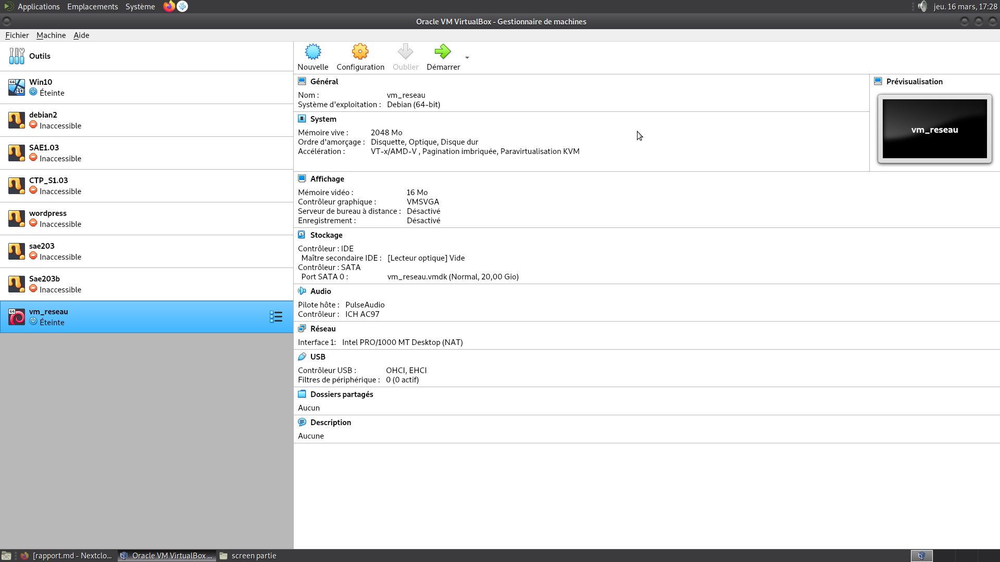{ width=700px, height=300px }

Une fois la machine démarrée, on choisit le type d'installation : *Graphical install* ou *install*. Dans notre cas, on choisit *Graphical install*

{ width=700px, height=300px }

On sélectionne la langue, dans notre cas, le Français

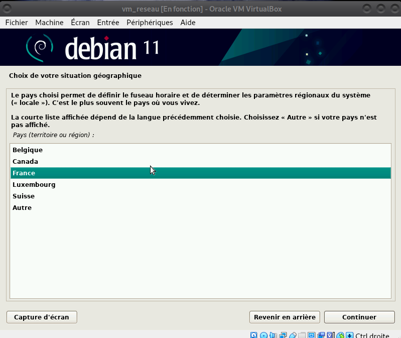{ width=700px, height=300px }

On définit le nom de la machine

{ width=700px, height=300px }

On choisit le mot de passe du superutilisateur

{ width=700px, height=300px }

On choisit le nom du nouvel utilisateur

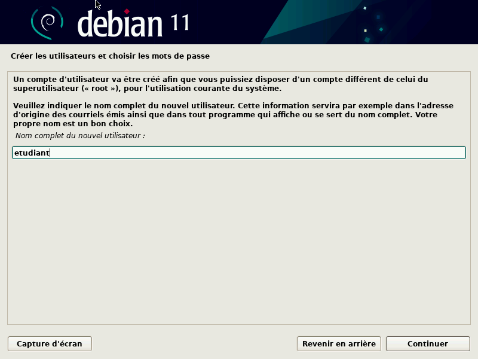{ width=700px, height=300px }

Le mot de passe de l'utilisateur

{ width=700px, height=300px }

On partitionne le disque

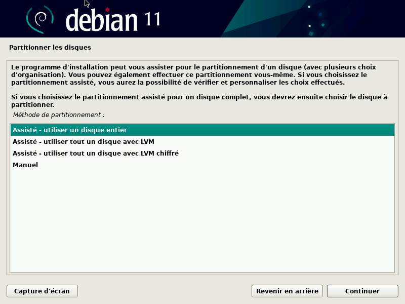{ width=700px, height=300px }

On choisit le mirroir pour la gestion de paquets

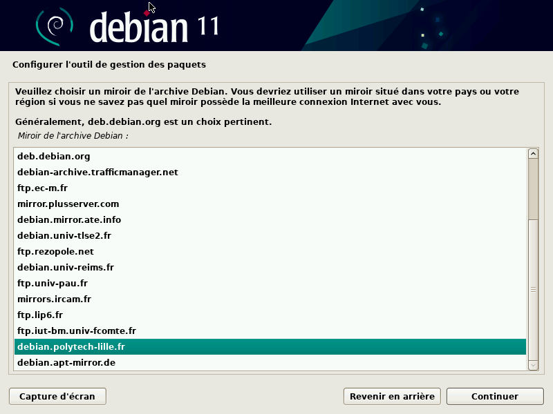{ width=700px, height=300px }

On paramètre le proxy, dans notre cas "http://cache.univ-lille.fr:3128"

> Nous avons ajouté un serveur mandataire permettant d'avoir un accès à Internet, permettant ainsi d’accéder à l’extérieur du réseau (qui est privé) de l'IUT pour communiquer avec le réseau Internet. C'est indispensable pour l'installation de certains paquets via le package manager apt.

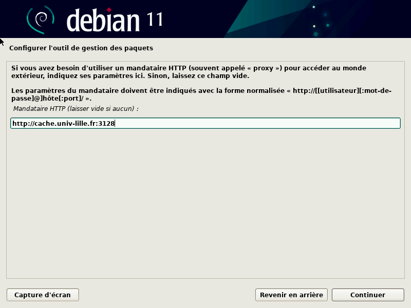{ width=700px, height=300px }

On installe GRUB

> Grub est un bootloader (ou chargeur d'amorçage en français) c'est le programme qui permet de démarrer sur un secteur d'amorçage tel qu'une distribution Linux, c'est notamment utile en dual boot permettant de démarrer sur l'un des 2 secteurs disponibles (Windows ou distribution GNU/Linux).

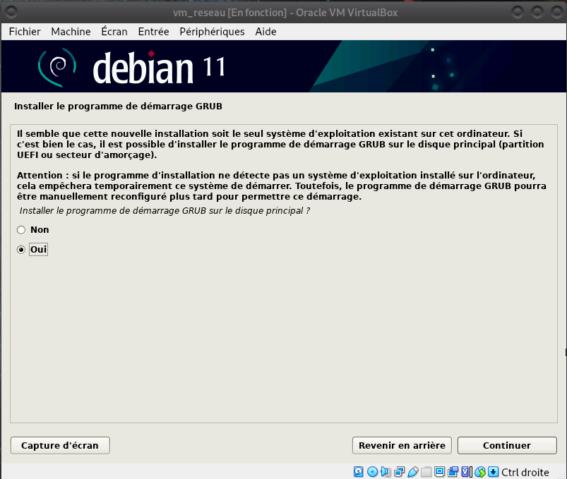{ width=700px, height=300px }

Et on termine l'installation, le système va redémarrer automatiquement.

{ width=700px, height=300px }

### 1.1.2 Quelques questions

1. Configuration matérielle dans VirtualBox
    - Que signifie “64-bit” dans “Debian 64-bit” ?

    64 bits c'est l'architecture utilisé par le système d'exploitation, ce qui signifie que l'OS est compatible avec un CPU qui comprend une taille de 64 bits en nombre entier sur le registre, càd la mémoire interne du processeur où les plus simples instructions sont stockés temporairement avec un accès en lecture/écriture extrêmement rapide.

    *source: [Wikipedia - Processeur 64 bits](https://fr.wikipedia.org/wiki/Processeur_64_bits)*
    
    - Quelle est la configuration réseau utilisée par défaut ?

    La configuration réseau par défaut est NAT (ou Network Adress Translation) qui permet de traduire les adresses ip de la machine hôte en une autre ip dédié à la machine virtuelle, pour cela Virtualbox utilise un routeur qui fait l'intérmediaire entre les machines virtuelles et la machine hôte pour un maximum de sécurité.

    *source: [documentation Virtualbox#network_nat](https://www.virtualbox.org/manual/ch06.html#network_nat)*
    
    - Quel est le nom du fichier XML contenant la configuration de votre machine ?

    Le nom du fichier XML contentant la configuration de la machine est 'sae203.vbox'.
    
    *source: [documentation Virtualbox#vboxconfigdata-summary-locations](https://www.virtualbox.org/manual/ch10.html#vboxconfigdata-summary-locations)*

    - Sauriez-vous le modifier directement ce fichier pour mettre 2 processeurs à votre machine ? Faites-le.

    Nous pouvons remarquer que le nombre de CPUs est de 1, on peut le modifier via l'interface graphique, cependant il existe toute la configuration de la VM dans le fichier XML cité au-dessus et on peut lui augmenter le nombre de CPUs avec la ligne suivante: ``<CPU count="2">``. 
  
    Il est impossible de sourcer cette réponse, la ligne peut être automatiquement générée à partir de l'interface graphique, malgré la possible configuration dans le fichier XML cela n'est pas recommandé selon la documentation car la configuration est écrasé plus tard, donc il est conseillé d'utiliser la commande 'VBoxManage' ou l'interface graphique comme indiqué dans le 2ème screen ci-dessous...

    > *"We intentionally do not document the specifications of the Oracle VM VirtualBox XML file"*, [documentation Virtualbox#vboxconfigdata-XML-files](https://www.virtualbox.org/manual/ch10.html#vboxconfigdata-XML-files).

   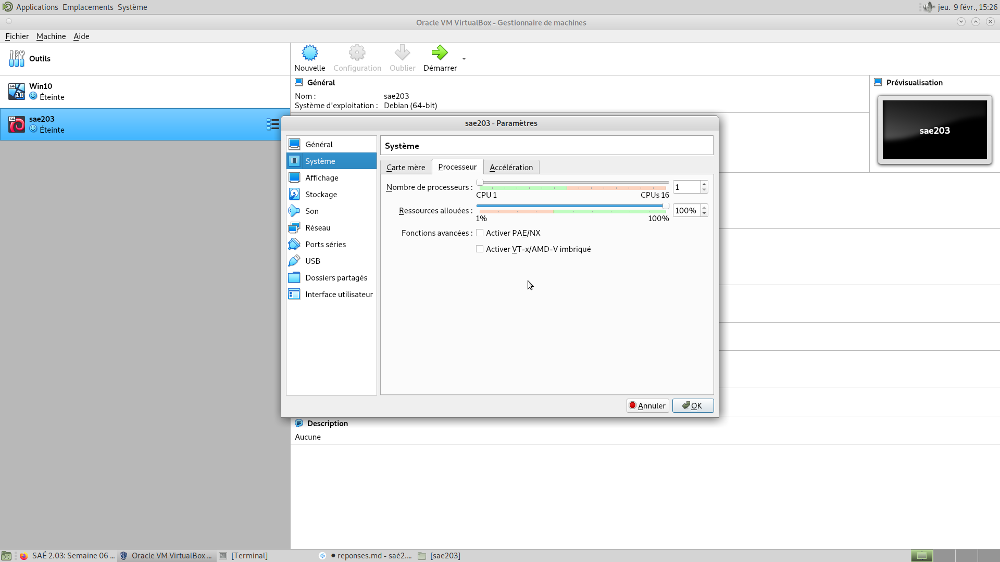{ width=800px, height=600px }

   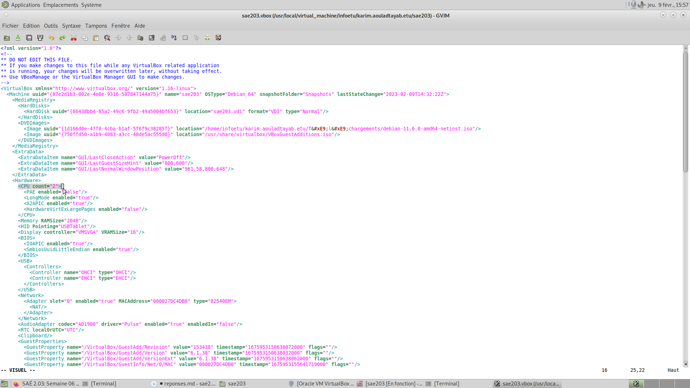{ width=800px, height=600px }

## 1.2 Installation de l'OS

2. Installation OS de base

    - Qu’est-ce qu’un fichier iso bootable ?

    Un fichier iso bootable est un fichier qui peut se déclencher dans le secteur d'amorçage de la machine afin de démarrer un programme (OS).

    - Qu’est-ce que MATE ? GNOME ?

    MATE est un environnement de bureau et c'est un fork (clone) de la version 2 de GNOME qui est un autre environnement de bureau.

    *source: [documentation Ubuntu sur MATE](https://doc.ubuntu-fr.org/mate)*

    - Qu’est-ce qu’un serveur web ?

    Un serveur web est un serveur qui a comme principal rôle de rendre des services via des requêtes respectant le protocole HTTP/HTTPS pour un ou plusieurs machines qu'on appelle les clients.

    - Qu’est-ce qu’un serveur ssh ?

    Un serveur ssh est un serveur avec le service ssh activé. Ssh permet d'avoir une connexion distante sécurisé entre plusieurs machines et chiffrés par RSA (chiffrement asymétrique).

    - Qu’est-ce qu’un serveur mandataire ?

    Un serveur mandataire (ou proxy) est un serveur qui fait l'intérmediaire entre le réseau privé et l'éxterieur afin de pouvoir se connecter à des réseaux tels que Internet.

## 2.1 Accès ``sudo`` pour user
La commande ``adduser [nom_utilisateur] [groupe]`` permet d'ajouter l'utilisateur user dans le groupe sudo donc lui donner les droits sudo (super-utilisateur).


3. Comment peux-ton savoir à quels groupes appartient l’utilisateur user ?

    Pour connaître les groupes de l'utilisateur courant, nous utilisons la commande ``groups``
    
    > On peut remarquer qu'il a bien les droits sudo...

    *source: [groups(1) - man page](https://linux.die.net/man/1/groups)*

    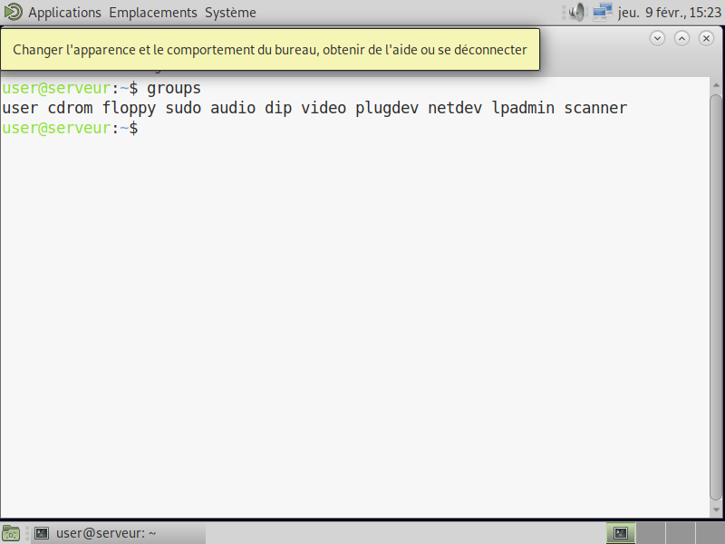

## 2.2 Installations des suppléments invités

4. Suppléments invités

    - Quel est la version du noyau Linux utilisé par votre VM ? N’oubliez pas, comme pour toutes les questions, de justifier votre réponse.
    
    La version du noyau Linux utilisé par la VM est 5.10.0. La commande ``uname -a`` permet d'afficher plusieurs informations relatives au système.

    *source: [uname(1) - man page](https://linux.die.net/man/1/uname)*
    
    


    - À quoi servent les suppléments invités ? Donner 2 principales raisons de les installer.
    
    Les suppléments invités permettent de:

    *source: [documentation Virtualbox#guestadd-intro](https://www.virtualbox.org/manual/ch04.html#guestadd-intro)*

    1. Redimensionner l'écran pour un usage plus confortable.
         
    > "*In addition, with Windows, Linux, and Oracle Solaris guests, you can resize the virtual machine's window if the Guest Additions are installed...*"

    2. Faire un drag'n'drop de fichiers entre machine hôte et invité.
  
    > "*Generic host/guest communication channels. The Guest Additions enable you to control and monitor guest execution. The guest properties provide a generic string-based mechanism to exchange data bits between a guest and a host...*"

    - À quoi sert la commande mount (dans notre cas de figure et dans le cas général) ?
    
    La commande mount permet créer un point de montage dans le système, c'est-à-dire un accès (sous forme de répértoire) au périphérique monté. 

    *source: [mount(8) - man page](https://man7.org/linux/man-pages/man8/mount.8.html)*

    Dans ce cas de figure, on monte le périphérique ``/dev/cdrom/`` dans ``/mnt`` pour graver l'image iso du CD des additions invités.

# (Semaine 09) Installation Debian automatisée par pré-configuration

## 3.1 Quelques questions

1. Qu’est-ce que le Projet Debian ? D’où vient le nom Debian ?

    - Le projet 'Debian' est une initiative venant d'un groupe de volontaires venant des 4 coins de la planète dans le but de produire des logiciels libres, le logiciel le plus populaire est la distribution GNU/Linux sous le même nom. 

    *source: [The Debian Project#begining](https://www.debian.org/doc/manuals/project-history/intro.en.html#begining)*

    > "The Debian Project is a worldwide group of volunteers who endeavor to produce an operating system distribution that is composed entirely of free software. The principle product of the project to date is the Debian GNU/Linux software distribution."

    - Le nom 'Debian' provient du nom du créateur et de celui de sa femme.

    *source: [The Debian Project#pronouncing-debian](https://www.debian.org/doc/manuals/project-history/intro.en.html#pronouncing-debian)*

    > The official pronunciation of Debian is 'deb ee n'. The name comes from the names of the creator of Debian, Ian Murdock, and his wife, Debra. 

2. Il existe 3 durées de prise en charge (support) de ces versions : la durée minimale, la durée en support long terme (LTS) et la durée en support long terme étendue (ELTS). Quelle sont les durées de ces prises en charge ?

    - La durée pour une LTS est de 5 ans

    *source: [LTS](https://wiki.debian.org/LTS)*

    > Debian Long Term Support (LTS) is a project to extend the lifetime of all Debian stable releases to (at least) 5 years.

    - Pour une ELTS (LTS étendu) c'est 10 ans

    *source: [ELTS](https://wiki.debian.org/LTS/Extended)*

    > Extended Long Term Support (ELTS) is a commercial offering to further extend the lifetime of Debian releases to 10 years.

3. Pendant combien de temps les mises à jour de sécurité seront-elles fournies ?

    Les mises à jour de sécurités sont fournies pendant 1 an après la nouvelle version stable.

    *source: [FAQ sur les mises à jours](https://www.debian.org/security/faq.fr.html#lifespan)*

    > L'équipe en charge de la sécurité essaye de prendre en charge la distribution stable environ une année après que la version stable suivante a été publiée, sauf lorsqu'une autre distribution stable est publiée la même année. Il n'est pas possible de prendre en charge trois distributions, c'est déjà bien assez difficile avec deux.

4. Combien de version au minimum sont activement maintenues par Debian ? Donnez leur nom générique (= les types de distribution).

    Il y a 3 versions de debian qui sont activement maintenues : 

    - **stable**
    - **testing**
    - **unstable**

    *source : [VERSION](https://www.debian.org/releases/index.fr.html)*

    > Debian a toujours au moins trois versions activement entretenues : "stable", "testing" et "unstable".

5. Chaque distribution majeur possède un nom de code différent. Par exemple, la version majeur actuelle (Debian 11) se nomme Bullseye. D’où viennent les noms de code données aux distributions ?

    Les noms de code proviennent des films "Toy Story". Bullseye (Debian 11) était le cheval de bois de Woody. 

    *source : [Nom de code](https://www.debian.org/doc/manuals/debian-faq/ftparchives#sourceforcodenames)*

    > Jusqu'ici les noms de code proviennent des personnages des films « Toy Story » par Pixar. 

6. L’un des atouts de Debian fut le nombre d’architectures officiellement prises en charge. Combien et lesquelles sont prises en charge par la version Bullseye ?

    Debian 11 fonctionne sur 9 architectures principales dont :

    - AMD64 & Intel 64
    - Intel x86-based
    - ARM
    - ARM avec matériel FPU
    - ARM 64 bits
    - MIPS 64 bits
    - MIPS 32 bits
    - Power Systems
    - IBM S/390 64 bits

    *Source : [Architectures](https://www.debian.org/releases/stable/i386/ch02s01.fr.html)*

7. Première version avec un nom de code
    - Quelle a était le premier nom de code utilisé ?
    - Quand a-t-il été annoncé ?
    - Quelle était le numéro de version de cette distribution ?

    La première version de Debian avec un nom de code se nommant "Buzz" Elle a été publiée le 17 juin 1996 sous le nom de Debian GNU/Linux 1.1

    *Source : [Première version](https://wiki.debian.org/fr/DebianBuzz)*

8. Dernière nom de code attribué
    - Quel est le dernier nom de code annoncée à ce jour ?
    - Quand a-t-il été annoncé ?
    - Quelle est la version de cette distribution ?

    Le dernier nom de code est "Bullseye", elle a été publier le  14 août 2021 la première version de la distribution est la version 11.0 de Debian et sa dernière mise à jour a donnée la version 11.6 de Debian.

    *Source : [Dernier nom de code](https://www.debian.org/releases/index.fr.html)*

## 3.2 Préparation de la VM

Nous avons crée une machine virtuelle avec la configuration matérielle attendu (RAM, Espace disque).

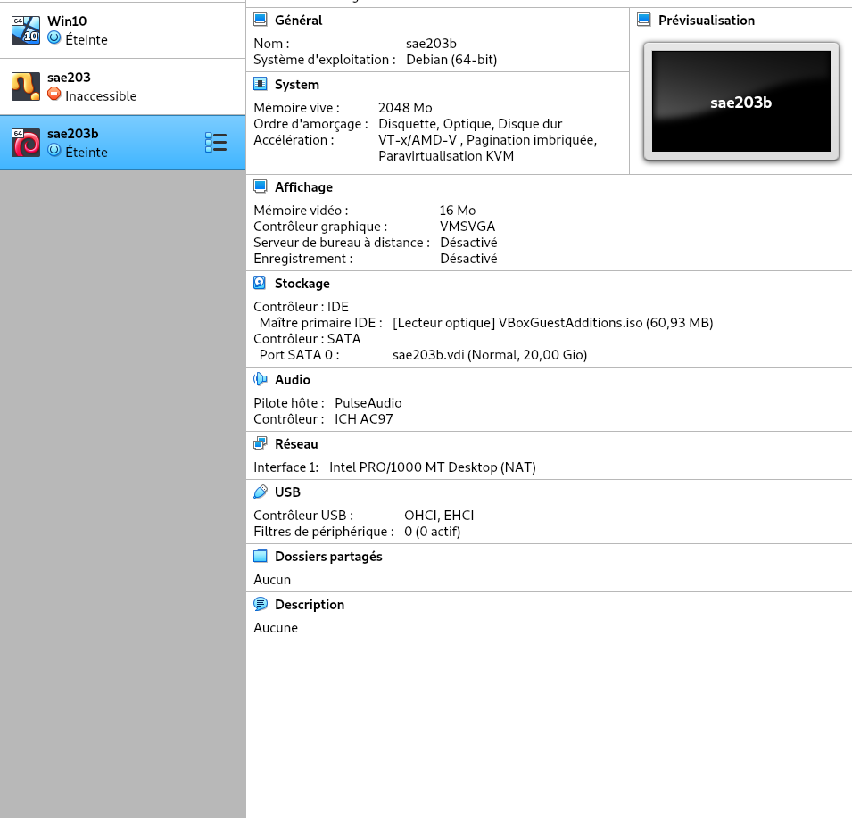{ width=800px, height=600px }

## 3.3 Installation automatisée via une pré-configuration

Et la mise en place de la VM a pu se réaliser sans problèmes avec les fichiers du dossier autoinstall (notamment le fichier **S203-Debian11.viso**, la pré-configuration **preseed-fr.cfg**) présent sur Moodle permettant de gérer de manière automatique toute l'installation suivi d'un l'intégration des additions invitées de Virtualbox.

{ width=800px, height=600px }

## 3.4 Pré-configuration customisé

> Ajouter le droit d’utiliser sudo à l’utilisateur standard

Dans le fichier 'preseed-fr.cfg', nous ajoutons le groupe 'sudo':

```
d-i passwd/user-default-groups string audio cdrom video sudo
```

> Installer l’environnement MATE.

Nous devons insérer mate-desktop sur cette ligne:

```
tasksel tasksel/first multiselect standard ssh-server, mate-desktop
```

> Ajouter les paquets suivants : sudo, git, sqlite3, curl, bash-completion, neofetch

Nous devons insérer cette ligne dans le fichier 'preseed-fr.cfg', indiqué dans cette documentation:

*source: ([Pré-configuration#choix-des-paquets](https://www.debian.org/releases/stable/amd64/apbs04.fr.html))*

> "Si vous voulez installer des paquets particuliers en plus des paquets installés par les tâches, vous pouvez utiliser le paramètre pkgsel/include. Séparez les valeurs par des virgules ou des espaces. Vous pouvez ainsi l'utiliser facilement sur la ligne de commande du noyau."

```
d-i pkgsel/include string git, sqlite3, curl, bash-completion, neofetch
```

{ width=800px, height=600px }

# (Semaine 10 et 11) Gitea

## 4.1 Configuration globale de git

Nous procédons au préliminaires, en configurant quelques variables relatif à la commande git, notamment le nom de l'auteur du commit, son email et le nom par défaut de la branche de tous les repos. Cela nous sera utile plus tard dans la configuration de Gitea. (cf [Utilisation basique de Gitea](#utilisation-basique-de-gitea)).

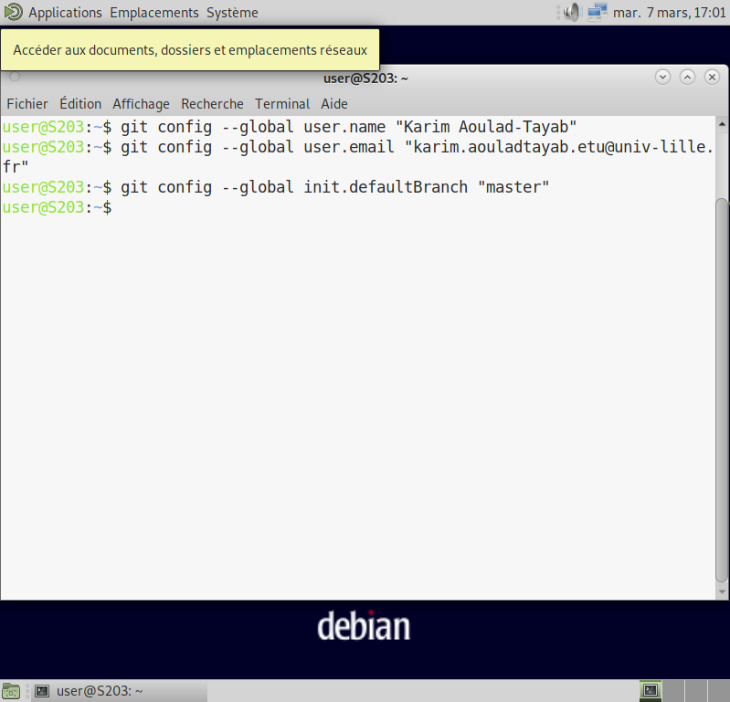{ width=800px, height=600px }

1. Préliminaire

    - Qu’est-ce que le logiciel git-gui ? Comment se lance-t-il ?

        git-gui est une interface graphique complète et intégré à la commande git via la commande ``git gui [<command>] [<arguments>] ``, elle permet de de faire la plupart des commandes que l'on tape souvent sur git (``git push``, ``git branch``, etc...).

        *source: [git-gui](https://git-scm.com/docs/git-gui/)*

        > A Tcl/Tk based graphical user interface to Git. git gui focuses on allowing users to make changes to their repository by making new commits, amending existing ones, creating branches, performing local merges, and fetching/pushing to remote repositories.

    -  Mêmes questions avec gitk.

        gitk est une interface graphique utilisant le protocole git permettant de visualiser l'historique des commits d'un repos sous forme de graphe. ``gitk & `` dans le même répertoire que le projet.

        *source: [gitk](https://git-scm.com/docs/gitk)*

    - Quelle sera la ligne de commande git pour utiliser par défaut le proxy de l’université sur tous vos projets git ?

        La commande git pour utiliser le proxy de l'université est ``git config --global http.proxy ``. Cela nous permet ainsi d'utiliser toutes les commandes git utilisant Internet (comme ``git push``) en passant par le proxy.

        *source: [git-config#httpproxy](https://git-scm.com/docs/git-config#Documentation/git-config.txt-httpproxy)*

        > Override the HTTP proxy, normally configured using the http_proxy, https_proxy, and all_proxy environment variables

## 4.2 Gestion de la redirection des ports
Nous devons rediriger les requêtes de la machine hôte provenant du port 3000 vers la machine virtuelle afin de consulter le serveur gitea local depuis la machine hôte. Pour cela on procède à une redirection de port.

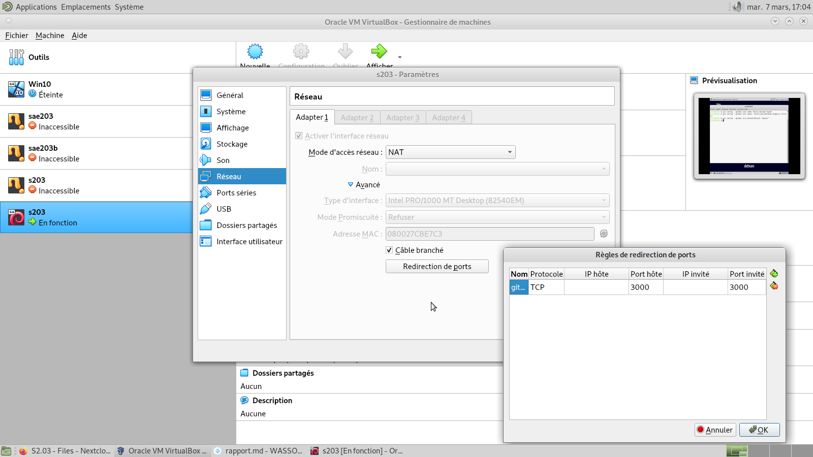{ width=800px, height=600px }

## 4.3 Installation de Gitea

Avant d'installer gitea, il faut configurer le proxy car nous sommes dans le réseau de l'IUT, dans un réseau privé en dehors d'Internet.

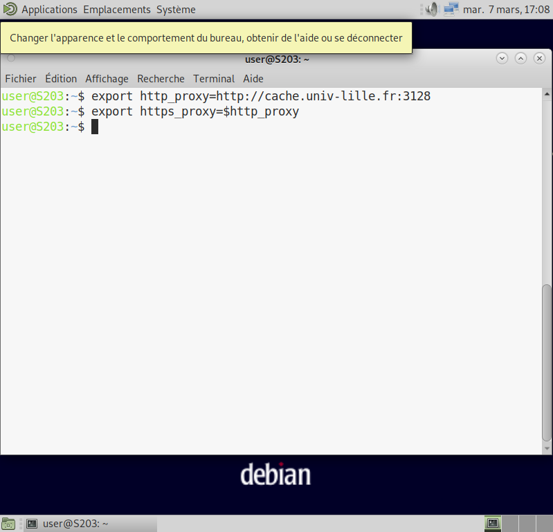{ width=800px, height=600px }

Voici les commandes pour installer gitea:
- (1) On récupère depuis un serveur distant (ici celui celui de gitea.com) le fichier binaire à la version 1.18.5
- (2) On crée un utilisateur spécifique nommé 'git' pour toutes les tâches relatives à gitea
- (3) On configure les droits correctement pour que les fichiers relatifs à Gitea soit administré par l'utilisateur 'git' et également on restreint les droits pour que 'other' (les autres) n'aient aucun accès à ces chemins (à part l'admin, l'utilisateur 'git' suivi des groupes attribués)
- (3) On déplace les fichiers (dans le dossier bin pour avoir l'executable exporté dans le path ``/usr/bin``)

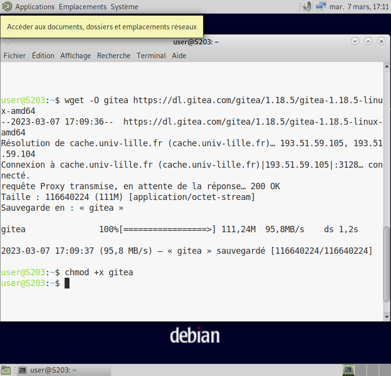{ width=800px, height=600px }
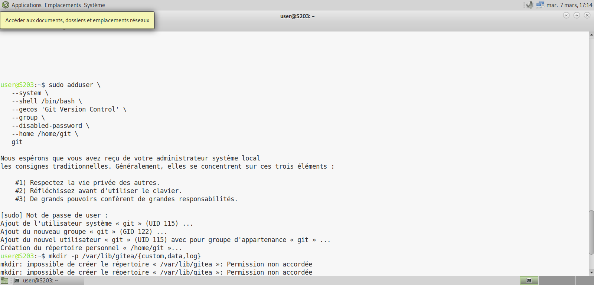{ width=800px, height=600px }
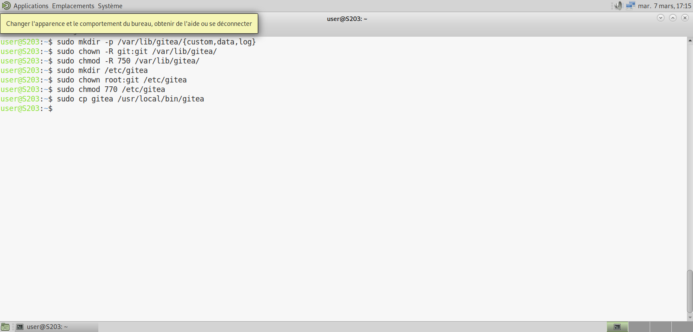{ width=800px, height=600px }

2. À propos de Gitea 

    - Qu’est-ce que Gitea ?

        Gitea est un client git web similaire à GitHub, etc... mais avec la possibilité de self-host sa propre instance Gitea dans son propre serveur, cela permet notamment d'avoir le contrôle total des données qui transitent dans cette instance de Gitea.

        *source: [gitea](https://docs.gitea.io/fr-fr/)*

        > Gitea est un service Git auto-hébergé très simple à installer et à utiliser.

    - À quels logiciels bien connus dans ce domaine peut-on le comparer (en citer au moins 2) ?

        Nous avons comme logiciels similaires: Gogs et GitLab.

        *source: [alternativeto](https://alternativeto.net/software/gitea/?platform=self-hosted)*

## 4.4 Activation du service Gitea via systemd

Grâce à la commande systemd du même nom que l'init (premier programme qui s'éxecute à l'amorcage de l'OS dans la machine et qui lance tous les services nécessaires (ou non) au bon fonctionnement de l'OS) on peut activer un service automatiquement au démarrage associé à un programme (ici c'est gitea).

La commande ``sudo systemctl enable gitea`` active le service pour être prêt à être démarré et ``start`` le démarre directement.

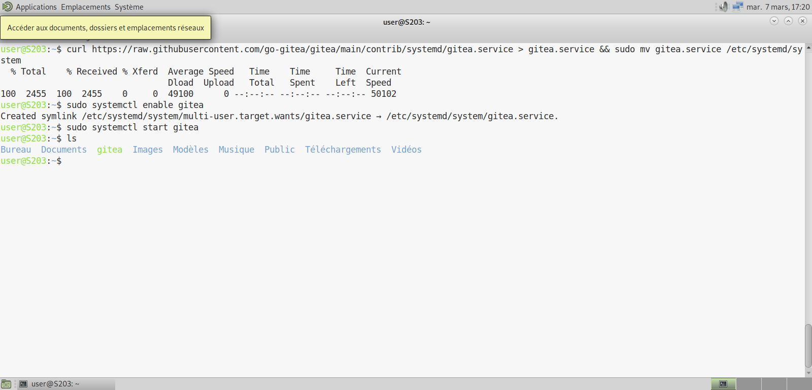{ width=800px, height=600px }

## 4.5 Paramétrage de Gitea

Pour vérifier que le service s'est bien démarré, on vérifie après le reboot avec la commande:

```sh
systemctl status gitea
```

Ici nous avons l'interface de départ avec certains paramètres modifiés/ajoutés au premier démarrage de Gitea dans ``localhost:3000``, accessible directement depuis la machine hôte grâce à la redirection de port.

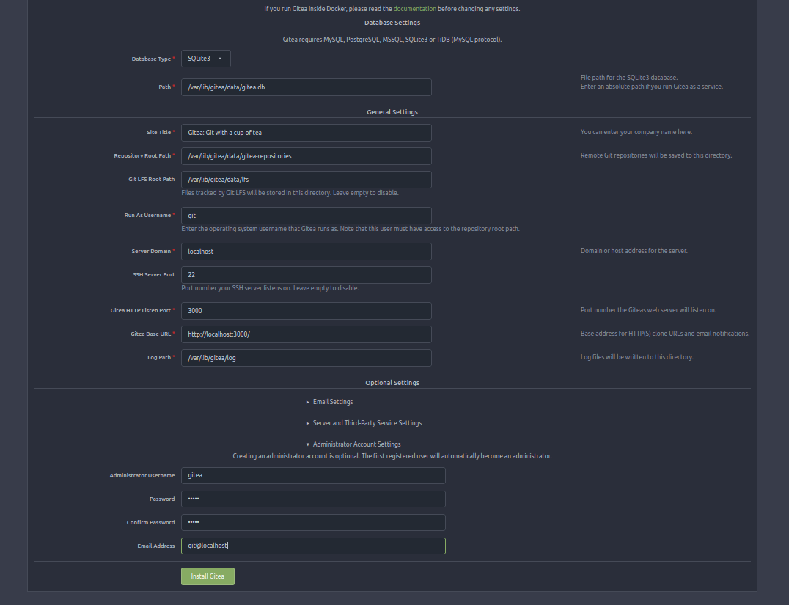{ width=800px, height=600px }

Une fois le service web Gitea installé, comme nous pouvons le voir tout en bas du screen ci-dessus, nous sommes redirigés dans notre compte administrateur.

{ width=800px, height=600px }

Maintenant que Gitea est installé, nous pouvons changer les permissions des chemins ``/etc/gitea`` et ``/etc/gitea/app.ini`` comme recommandé dans la documentation.

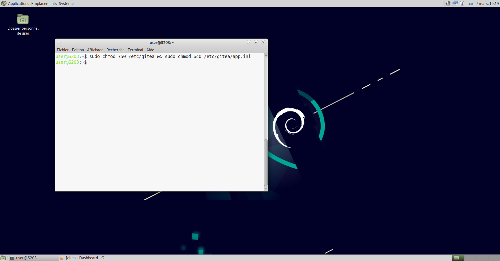{ width=800px, height=600px }


## 4.6 Utilisation basique de Gitea

3. Mise à jour
   
    - Comment faire pour la mettre à jour sans devoir tout reconfigurer ? Essayez en mettant à jour vers la version 1.19.

    Pour cela, nous devons arrêter le service gitea, remplacer le binaire gitea de la version actuelle par la nouvelle version, et relancer le service. Pour faire ceci sans reconfigurer soi-même, gitea a mit en place un script bash ([upgrade.sh](https://github.com/go-gitea/gitea/blob/main/contrib/upgrade.sh)) pour automatiser tout cela, on précise uniquement la version souhaité avec l'option ``-v``

```sh
sudo ./upgrade.sh -v 1.19
```


*source: [gitea#upgrade-from-binary](https://docs.gitea.io/en-us/upgrade-from-gitea/#upgrade-from-binary)*

> A script automating these steps for a deployment on Linux can be found at contrib/upgrade.sh in Gitea’s source tree.

Nous allons maintenant ajouter quelques repos pour tester les fonctionnalités et le bon fonctionnement de Gitea. Depuis l'interface Gitea nous pouvons créer et enrichir directement le repos (comem vous pouvez le voir dans le screen avec le repos example). Mais également depuis la commande git:

Voici un exemple avec le repos 'dev-oo' dédié aux tp de dev poo et qualité dev crée par chaque étudiant dans son propre compte Gitlab

Tout d'abord on crée le repos 'dev-oo' depuis l'interface de Gitea, puis on clone le dépot distant provenant de Gitlab, on change son origine pour lui attribuer celui de Gitea et ainsi commit puis push toutes les fichiers sur le repos 'dev-oo' dans Gitea.
```
git clone https://gitlab.univ-lille.fr/[login_etudiant]/dev-oo && cd dev-oo
git remote remove origin
git remote add origin http://localhost:3000/gitea/dev-oo
# La branche sur le repos git est main par défaut contrairement au paramétrage des préliminaires
git branch -m main master
# user: gitea, password: gitea
git push origin master
```

Également, pour les rapports de Saé 2.03, nous initialisons un repos git et on fait un premier commit distant avec tous les rapports:
```
git init
git remote add origin http://localhost:3000/gitea/s2.03
git add -A && git commit -m "Initial commit"
git push origin master
```

{ width=800px, height=600px }

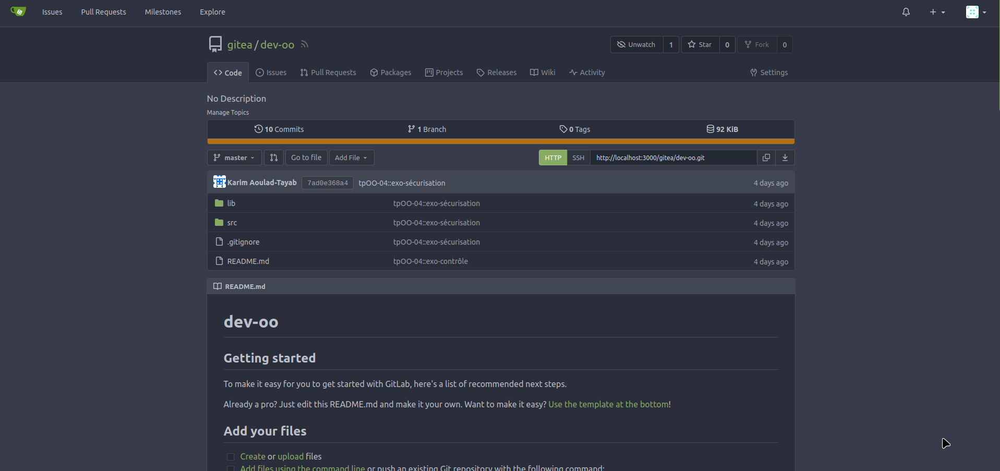{ width=800px, height=600px }

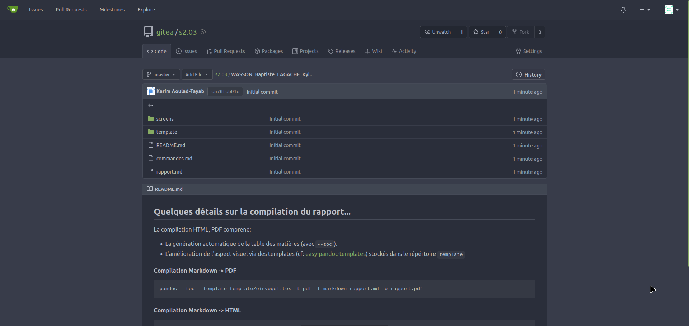{ width=800px, height=600px }